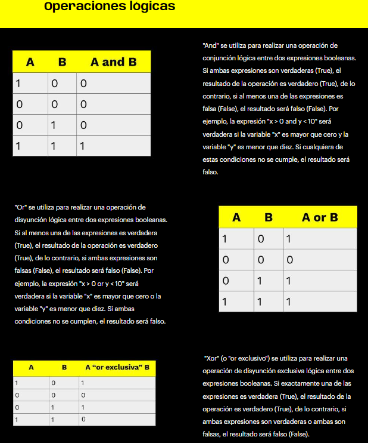

¿Variables?
Estructura de datos más simple que funciona como un contenedor que almacena un dato, asigna un espacio de memoria.
¿Constante?
Dato que no se almacena es una variable, que es fijo/constante.
¿Tipos de variables?
Enteros (int), floats (float), strings (str), booleanos (bool) y complejos (composición de números reales e imaginarios)
¿Principales palabras reservadas (funciones)?
PRINT->print()->para imprimir/mostrar en pantalla
TYPE->type()->para conocer el tipo de una variable
BOOL->bool()->para conocer si una variable es True (con valor asignado) o False (nula o sin valor asignado)
¿Operaciones aritméticas?

¿Operaciones relacionales?

¿Asignación?

¿Operaciones con strings?

¿Operaciones lógicas?

Conversiones->Se dan por el proceso casting.